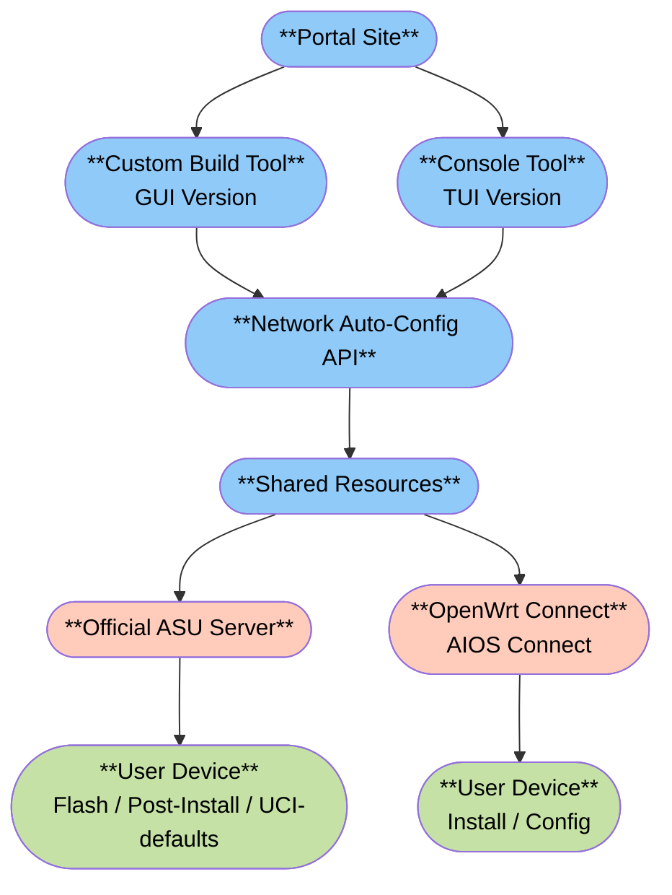

# OpenWrt Kitting Firmware Build

Japanese article


### Known Issues
Firmware Selector:
　uci-defaults (setup.sh): 20KB limit
　※ Restriction target: ASU's `defaults` field

SNAPSHOT builds:
　Weekends (Friday to Sunday) are replacement timing, so builds are better done at the beginning of the week

# Flash & Install System

### System Configuration Diagram


### Portal Site
[site-u.pages.dev/](https://site-u.pages.dev/)


<details><summary><b>Features</b></summary>

**Address**
- `IP Address`: (192.168.1.1 etc.)
- `+` / `-`: Add/Remove address
- `Apply`: Apply settings

**Browser**
- `Service`: (LuCI / ttyd / filebrowser / AdGuardHome / netdata)
- `+` / `-`: Add/Remove service
- `Port`: Port number
- `Apply`: Apply settings
- `Open`: Launch browser
- `QR Code`: Display QR code

**Terminal (for Windows)**
※Requires IP address selection (or addition)

- `Type` (aios2 / aios / ssh)
- `Download`: Get .bat file

**Kitting Tools (Custom Builder)**
`Download OpenWrt firmware for your device`: Custom build tool link

---

**Delete legacy protocol handler**
※For those who used previous versions

Registry for deletion: [delete.reg](https://github.com/site-u2023/site-u2023.github.io/blob/main/file/delete.reg)

---

</details>

### Custom Build Tool (Kitting Tool)
[site-u.pages.dev/www/](https://site-u.pages.dev/www/)


| Feature Comparison | Official Builder | Custom Builder |
|---------|-------------|-----------------|
| **Basic Features** |
| Device Search | ○ | ○ |
| Version Selection | ○ | ○ |
| Package Addition | Manual input | Preset + Manual input |
| Initial Boot Settings Addition | Manual input | Auto-generated + Manual edit |
| Country Code Auto-setting | × | ○ |
| Language Code Auto-setting | × | ○ |
| Timezone Auto-setting | × | ○ |
| Zone Name Auto-setting | × | ○ |
| ISP Auto-detection | × | ○ |
| **Japan-Specific Features** |
| DS-Lite Auto-configuration | × | Network Auto-Config API Integration |
| MAP-E Auto-configuration | × | Network Auto-Config API Integration |
| map.sh Patch Application | × | Nichiban (SNAT) countermeasure |
| **Advanced Features** |
| Settings Import/Export | × | Text format |
| ASU Server Health Check | × | Real-time display |
| **Bug Fixes** |
| IPv4 Address Change | × | SNAPSHOT supported |
| **Technical Specifications** |
| uci-defaults Size Limit | 20KB | 13KB implementation/20KB |
| API Server | ASU Official | ASU Official + Custom API |
| Hosting | OpenWrt Official | Cloudflare Pages |
| Open Source | GitHub Public | GitHub Public |

<details><summary><b>When MAP-E/DS-LITE auto-detection doesn't work</b></summary>
    
Enable DHCPv6-PD (IPv6 prefix delegation) on the upstream router
IPv6 bridge/passthrough function settings for each manufacturer:
- [TP-Link](https://www.tp-link.com/us/support/faq/1525/)
- [NETGEAR](https://kb.netgear.com/24006/How-do-I-set-up-an-IPv6-Internet-connection-on-my-NETGEAR-router)
- [ASUS](https://www.asus.com/support/faq/1030921/)
- [Linksys](https://support.linksys.com/kb/article/448-en/)

---
</details>

### OpenWrt Connect (AIOS Connect)


<details><summary><b>OpenWrt Connect (AIOS Connect)</b></summary>

[OpenWrt Connect SSH Key Authentication Automation Windows App](https://qiita.com/site_u/items/9111335bcbacde4b9ae5)

- Without link: [openwrt-connect.msi](https://github.com/site-u2023/openwrt-connect/releases)
- With link: [aios-connect.msi](https://github.com/site-u2023/site-u2023.github.io/releases/tag/release)

| **Direct Command** | Action |
|---|---|
| `aios2 basic-config` | Open Basic Configuration |
| `aios2 wifi-config` | Open Wi-Fi Configuration |
| `aios2 internet-connection` | Open Internet Connection |
| `aios2 tuning-config` | Open Tuning |
| `aios2 custom-scripts` | Open Custom Scripts |
| `aios2 packages` | Open Package Selection |
| `aios2 custom-feeds` | Open Custom Feeds |
| `aios2 restore-point` | Open Restore Point |
| `aios2 review` | Open Review Screen |
| `aios2` | Open Main Menu (no arguments) |

Known Bugs:
- [Windows 11's redesigned Start menu has some very strange bugs](https://www.neowin.net/news/windows-11s-redesigned-start-menu-has-some-very-strange-bugs/)

---

</details>


### Console Tool
[aios2 TUI Version (whiptail)](https://github.com/site-u2023/site-u2023.github.io/blob/main/www/aios2.sh)


- Cloudflare Pages
```sh
mkdir -p /tmp/aios2 && wget --no-check-certificate -O /tmp/aiost/aios2.sh "https://site-u.pages.dev/www/aios2.sh" && chmod +x /tmp/aiost/aios-tui.sh && /tmp/aiost/aios2.sh
```

- GitHub io
```sh
mkdir -p /tmp/aios2; wget --no-check-certificate -O /tmp/aiost/aios2.sh "https://raw.githubusercontent.com/site-u2023/site-u2023.github.io/main/www/aios2.sh"; chmod +x /tmp/aiost/aios2.sh; /tmp/aiost/aios2.sh
```

<details><summary>Old Version</summary>

### Qiita
[aios (all in one scripts)](https://qiita.com/site_u/items/bd331296ce535ed7a69e)
[config software](https://qiita.com/site_u/items/c6a50aa6dea965b5a774)

### GitHub
[site-u2023.github.io](https://github.com/site-u2023/site-u2023.github.io)
[site-u2023.github.io/www](https://github.com/site-u2023/site-u2023.github.io/tree/main/www)

---
</details>

### Network Auto-Config API
[auto-config.site-u.workers.dev/](https://auto-config.site-u.workers.dev/)
　
[auto-config.js (DB section partially omitted)](https://github.com/site-u2023/site-u2023.github.io/blob/main/api/auto-config.js)

### Shared Resources
/www
[config.js](https://github.com/site-u2023/site-u2023.github.io/blob/main/www/config.js)

/post-install
- [postinst.json](https://github.com/site-u2023/site-u2023.github.io/blob/main/www/post-install/postinst.json): [Explanation](https://github.com/site-u2023/site-u2023.github.io/blob/main/www/postinst.json.js.md)

- [postinst.sh](https://github.com/site-u2023/site-u2023.github.io/blob/main/www/post-install/postinst.sh) (aios2 exclusive)

/uci-defaults
- [setup.json](https://github.com/site-u2023/site-u2023.github.io/blob/main/www/uci-defaults/setup.json): [Explanation](https://github.com/site-u2023/site-u2023.github.io/blob/main/www/setup.sh.ja.md)

- [setup.sh](https://github.com/site-u2023/site-u2023.github.io/blob/main/www/uci-defaults/setup.sh)

/tui
- [review.json](https://github.com/site-u2023/site-u2023.github.io/blob/main/www/tui/review.json) (aios2 exclusive)

/langs
- [custom.**.json](https://github.com/site-u2023/site-u2023.github.io/tree/main/www/langs)

### Official ASU Server
[sysupgrade.openwrt.org/overview](https://sysupgrade.openwrt.org/overview)
- Online: Normal response (blank screen)
- Offline: No response

# Samples

### For Console Configuration
<details><summary>json</summary>

```sh
#!/bin/sh
cat > "/tmp/openwrt-network-auto-config.sh" << 'SCRIPT_END'
#!/bin/sh
set -eu
API_RESPONSE="$(wget -qO- https://auto-config.site-u.workers.dev/)"

echo "NOTICE=$(echo "$API_RESPONSE" | jsonfilter -e '@.notice')"
echo "LANGUAGE=$(echo "$API_RESPONSE" | jsonfilter -e '@.language')"
echo "COUNTRY=$(echo "$API_RESPONSE" | jsonfilter -e '@.country')"
echo "REGION_NAME=$(echo "$API_RESPONSE" | jsonfilter -e '@.regionName')"
echo "REGION_CODE=$(echo "$API_RESPONSE" | jsonfilter -e '@.region')"
echo "TIMEZONE=$(echo "$API_RESPONSE" | jsonfilter -e '@.timezone')"
echo "ZONENAME=$(echo "$API_RESPONSE" | jsonfilter -e '@.zonename')"

echo "IPV4=$(echo "$API_RESPONSE" | jsonfilter -e '@.ipv4')"
echo "IPV6=$(echo "$API_RESPONSE" | jsonfilter -e '@.ipv6')"
echo "ISP=$(echo "$API_RESPONSE" | jsonfilter -e '@.isp')"
echo "AS=$(echo "$API_RESPONSE" | jsonfilter -e '@.as')"

echo "AFTR_TYPE=$(echo "$API_RESPONSE" | jsonfilter -e '@.aftr.aftrType')"
echo "AFTR_FQDN=$(echo "$API_RESPONSE" | jsonfilter -e '@.aftr.aftrFqdn')"
echo "AFTR_IPV6_EAST=$(echo "$API_RESPONSE" | jsonfilter -e '@.aftrAddresses.east')"
echo "AFTR_IPV6_WEST=$(echo "$API_RESPONSE" | jsonfilter -e '@.aftrAddresses.west')"


echo "AFTR_JURISDICTION=$(echo "$API_RESPONSE" | jsonfilter -e '@.aftr.jurisdiction')"
echo "AFTR_IPV6=$(echo "$API_RESPONSE" | jsonfilter -e '@.aftr.aftrIpv6Address')"

echo "AFTR_PEERADDR=$(echo "$API_RESPONSE" | jsonfilter -e '@.aftr.peeraddr')"
echo "AFTR_ADDRESS=$(echo "$API_RESPONSE" | jsonfilter -e '@.aftr.aftrAddress')"

echo "MAPE_BR_IPV6=$(echo "$API_RESPONSE" | jsonfilter -e '@.mape.brIpv6Address')"
echo "MAPE_EA_BITS=$(echo "$API_RESPONSE" | jsonfilter -e '@.mape.eaBitLength')"
echo "MAPE_IPV4_PREFIX=$(echo "$API_RESPONSE" | jsonfilter -e '@.mape.ipv4Prefix')"
echo "MAPE_IPV4_PLEN=$(echo "$API_RESPONSE" | jsonfilter -e '@.mape.ipv4PrefixLength')"
echo "MAPE_IPV6_PREFIX=$(echo "$API_RESPONSE" | jsonfilter -e '@.mape.ipv6Prefix')"
echo "MAPE_IPV6_PLEN=$(echo "$API_RESPONSE" | jsonfilter -e '@.mape.ipv6PrefixLength')"
echo "MAPE_PSID_OFFSET=$(echo "$API_RESPONSE" | jsonfilter -e '@.mape.psIdOffset')"
echo "MAPE_PSIDLEN=$(echo "$API_RESPONSE" | jsonfilter -e '@.mape.psidlen')"
echo "MAPE_CALC_OFFSET=$(echo "$API_RESPONSE" | jsonfilter -e '@.mape.calculatedOffset')"
echo "MAPE_IPV6_PREFIX_GUA=$(echo "$API_RESPONSE" | jsonfilter -e '@.mape.ipv6Prefix_gua')"

SCRIPT_END
sh "/tmp/openwrt-network-auto-config.sh"
```

---
</details>

<details><summary>MAP-E</summary>

```sh
#!/bin/sh
set -e

# Package installation
PKGS="map coreutils-sha1sum"
if command -v opkg >/dev/null 2>&1; then
    opkg update
    opkg install $PKGS
fi
if command -v apk >/dev/null 2>&1; then
    apk update
    apk add $PKGS
fi

# Variable definition
WAN="$(uci -q get network.wan.device || echo wan)"
MAPE="mape"
MAPE6="mape6"

# Retrieve MAP-E information from API
API_RESPONSE=$(wget -qO- https://auto-config.site-u.workers.dev/)
mape_br=$(echo "$API_RESPONSE" | jsonfilter -e '@.mape.brIpv6Address')
mape_ipv4_prefix=$(echo "$API_RESPONSE" | jsonfilter -e '@.mape.ipv4Prefix')
mape_ipv4_prefixlen=$(echo "$API_RESPONSE" | jsonfilter -e '@.mape.ipv4PrefixLength')
mape_ipv6_prefix=$(echo "$API_RESPONSE" | jsonfilter -e '@.mape.ipv6Prefix')
mape_ipv6_prefixlen=$(echo "$API_RESPONSE" | jsonfilter -e '@.mape.ipv6PrefixLength')
mape_ealen=$(echo "$API_RESPONSE" | jsonfilter -e '@.mape.eaBitLength')
mape_psidlen=$(echo "$API_RESPONSE" | jsonfilter -e '@.mape.psidlen')
mape_psid_offset=$(echo "$API_RESPONSE" | jsonfilter -e '@.mape.psIdOffset')
mape_gua_prefix=$(echo "$API_RESPONSE" | jsonfilter -e '@.mape.ipv6Prefix_gua')

# Network configuration
uci batch <<EOF
set network.wan.disabled='1'
set network.wan.auto='0'
set network.wan6.disabled='1'
set network.wan6.auto='0'
set network.${MAPE6}=interface
set network.${MAPE6}.proto='dhcpv6'
set network.${MAPE6}.device='${WAN}'
set network.${MAPE6}.reqaddress='try'
set network.${MAPE6}.reqprefix='auto'
set network.${MAPE}=interface
set network.${MAPE}.proto='map'
set network.${MAPE}.maptype='map-e'
set network.${MAPE}.peeraddr='${mape_br}'
set network.${MAPE}.ipaddr='${mape_ipv4_prefix}'
set network.${MAPE}.ip4prefixlen='${mape_ipv4_prefixlen}'
set network.${MAPE}.ip6prefix='${mape_ipv6_prefix}'
set network.${MAPE}.ip6prefixlen='${mape_ipv6_prefixlen}'
set network.${MAPE}.ealen='${mape_ealen}'
set network.${MAPE}.psidlen='${mape_psidlen}'
set network.${MAPE}.offset='${mape_psid_offset}'
set network.${MAPE}.mtu='1460'
set network.${MAPE}.encaplimit='ignore'
set network.${MAPE}.legacymap='1'
set network.${MAPE}.tunlink='${MAPE6}'
EOF

# Configure only if GUA prefix exists
if [ -n "${mape_gua_prefix}" ]; then
    uci -q set network.${MAPE6}.ip6prefix="${mape_gua_prefix}"
fi

uci commit network

# DHCP configuration
uci batch <<EOF
set dhcp.${MAPE6}=dhcp
set dhcp.${MAPE6}.interface='${MAPE6}'
set dhcp.${MAPE6}.master='1'
set dhcp.${MAPE6}.ra='relay'
set dhcp.${MAPE6}.dhcpv6='relay'
set dhcp.${MAPE6}.ndp='relay'
set dhcp.${MAPE6}.ignore='1'
set dhcp.lan.ra='relay'
set dhcp.lan.dhcpv6='relay'
set dhcp.lan.ndp='relay'
set dhcp.lan.force='1'
commit dhcp
EOF

# Firewall configuration
uci batch <<EOF
del_list firewall.@zone[1].network='wan'
del_list firewall.@zone[1].network='wan6'
add_list firewall.@zone[1].network='${MAPE}'
add_list firewall.@zone[1].network='${MAPE6}'
set firewall.@zone[1].masq='1'
set firewall.@zone[1].mtu_fix='1'
commit firewall
EOF

# map.sh modification
MAP_SH="/lib/netifd/proto/map.sh"  
EXPECTED_HASH="7f0682eeaf2dd7e048ff1ad1dbcc5b913ceb8de4"
ACTUAL_HASH=$(sha1sum "$MAP_SH" | awk '{print $1}')
if [ "$ACTUAL_HASH" = "$EXPECTED_HASH" ]; then
cp "$MAP_SH" "$MAP_SH.bak"
sed -i '1a # github.com/fakemanhk/openwrt-jp-ipoe\nDONT_SNAT_TO="0"' "$MAP_SH"
sed -i 's/mtu:-1280/mtu:-1460/g' "$MAP_SH"
sed -i '137,158d' "$MAP_SH"
sed -i '136a\
\t  if [ -z "$(eval "echo \\$RULE_${k}_PORTSETS")" ]; then\
\t    json_add_object ""\
\t      json_add_string type nat\
\t      json_add_string target SNAT\
\t      json_add_string family inet\
\t      json_add_string snat_ip $(eval "echo \\$RULE_${k}_IPV4ADDR")\
\t    json_close_object\
\t  else\
\t    local portcount=0\
\t    local allports=""\
\t    for portset in $(eval "echo \\$RULE_${k}_PORTSETS"); do\
\t\tlocal startport=$(echo $portset | cut -d"-" -f1)\
\t\tlocal endport=$(echo $portset | cut -d"-" -f2)\
\t\tfor x in $(seq $startport $endport); do\
\t\t\tif ! echo "$DONT_SNAT_TO" | tr " " "\\n" | grep -qw $x; then\
\t\t\t\tallports="$allports $portcount : $x , "\
\t\t\t\tportcount=`expr $portcount + 1`\
\t\t\tfi\
\t\tdone\
\t    done\
\t\tallports=${allports%??}\
\t    nft add table inet mape\
\t    nft add chain inet mape srcnat {type nat hook postrouting priority 0\\; policy accept\\; }\
\t\tlocal counter=0\
\t    for proto in icmp tcp udp; do\
\t\t\tnft add rule inet mape srcnat ip protocol $proto oifname "map-$cfg" counter packets 0 bytes 0 snat ip to $(eval "echo \\$RULE_${k}_IPV4ADDR") : numgen inc mod $portcount map { $allports }\
\t    done\
\t  fi' "$MAP_SH"
fi

echo "MAP-E and map.sh configuration completed"
echo "Press any key to reboot"
read dummy
reboot
```

---
</details>

<details><summary>DS-Lite</summary>

```sh
#!/bin/sh
set -e

# Package installation
PKGS="ds-lite"
if command -v opkg >/dev/null 2>&1; then
    opkg update
    opkg install $PKGS
fi
if command -v apk >/dev/null 2>&1; then
    apk update
    apk add $PKGS
fi

# Variable definition
WAN="$(uci -q get network.wan.device || echo wan)"
DSL="dsl"
DSL6="dsl6"

# Retrieve DS-Lite AFTR information from API
API_RESPONSE=$(wget -qO- https://auto-config.site-u.workers.dev/)
dslite_aftr_address=$(echo "$API_RESPONSE" | jsonfilter -e '@.aftr.aftrIpv6Address')

# Network configuration
uci batch <<EOF
set network.wan.disabled='1'
set network.wan.auto='0'
set network.wan6.disabled='1'
set network.wan6.auto='0'
set network.${DSL6}=interface
set network.${DSL6}.proto='dhcpv6'
set network.${DSL6}.device='${WAN}'
set network.${DSL6}.reqaddress='try'
set network.${DSL6}.reqprefix='auto'
set network.${DSL}=interface
set network.${DSL}.proto='dslite'
set network.${DSL}.peeraddr='${dslite_aftr_address}'
set network.${DSL}.tunlink='${DSL6}'
set network.${DSL}.mtu='1460'
set network.${DSL}.encaplimit='ignore'
commit network
EOF

# DHCP configuration
uci batch <<EOF
set dhcp.${DSL6}=dhcp
set dhcp.${DSL6}.interface='${DSL6}'
set dhcp.${DSL6}.master='1'
set dhcp.${DSL6}.ra='relay'
set dhcp.${DSL6}.dhcpv6='relay'
set dhcp.${DSL6}.ndp='relay'
set dhcp.${DSL6}.ignore='1'
set dhcp.lan.ra='relay'
set dhcp.lan.dhcpv6='relay'
set dhcp.lan.ndp='relay'
set dhcp.lan.force='1'
commit dhcp
EOF

# Firewall configuration
uci batch <<EOF
del_list firewall.@zone[1].network='wan'
del_list firewall.@zone[1].network='wan6'
add_list firewall.@zone[1].network='${DSL}'
add_list firewall.@zone[1].network='${DSL6}'
set firewall.@zone[1].masq='1'
set firewall.@zone[1].mtu_fix='1'
commit firewall
EOF

echo "DS-Lite configuration completed"
echo "Press any key to reboot"
read dummy
reboot
```

---
</details>

# Official

### Table of Hardware: Full details
https://openwrt.org/toh/views/toh_extended_all
https://openwrt.org/toh.json
 
### firmware-selector-openwrt-org

https://github.com/openwrt/firmware-selector-openwrt-org

### Attendedsysupgrade Server (GSoC 2017)

https://github.com/openwrt/asu

API
- https://sysupgrade.openwrt.org/docs
- https://sysupgrade.openwrt.org/redoc

# Qiita
[OpenWrt キッティング ファームウェア ビルド](https://qiita.com/site_u/items/4211dd57aa6e2a4a4e06)
